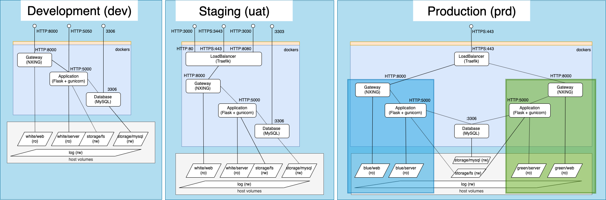

# O.M.B One Machine Band
The following repository contians a set of scripts and a tree structure to host a development, acceptance and production environment based on docker for web developments.
The Production phase is capable of blue-green deploy.





# How to use it in brief
## Development / testing
```sh {.line-numbers}
git clone <this-repo>
./set_phase dev|uat
git clone remote-source-repository my-source-server-folder
git clone remote-source-repository my-source-web-folder
python activate.py -i my-source-server-folder -a server
python activate.py -i my-source-web-folder -a web
curl -LI 127.0.0.1:8000 -s (dev)
curl -LI 127.0.0.1:3000 -s (uat)
```
## Production
```sh {.line-numbers}
git clone <this repo>
./set_phase prd
./init
vim .deploy #edit eventually the repository link with source code for server and web
python deploy.py -a <APPLICATION> -v <VERSION>
python activate.py -a <APPLICATION> -v <VERSION> 
curl -LI 127.0.0.1 -s

```

# Specification
Folder tree
```sh
├── activate.py                  <-- used in dev, uat, prd
├── connect                      <-- used in dev, uat, prd
├── dcompose                     <-- used in dev, uat, prd
├── deploy.py                    <-- used in uat, prd
├── env
  ├── blue                       <-- used in prd
  ├── cert                       <-- used in uat, prd
  ├── docker-compose.blue.yml    <-- used in prd
  ├── docker-compose.env.yml     <-- used in prd
  ├── docker-compose.green.yml   <-- used in prd
  ├── docker-compose.uat.yml     <-- used in uat
  ├── docker-compose.yml         <-- used in dev
  ├── docker-file                <-- used in dev, uat, prd
  ├── green                      <-- used in prd
  ├── trafeik.toml               <-- used in dev, uat
  └── white                      <-- used in dev, uat
├── init                         <-- used in prd
├── README.md
├── set_phase                    <-- used in dev, uat, prd
├── src                          <-- used in [dev], uat, prd
├── state                        <-- used in dev, uat, prd
├── stop                         <-- used in dev, uat, [prd]
├── storage                      <-- used in dev, uat, prd
├── tools                        <-- used in dev, uat, prd
└── up                           <-- used in dev, uat, prd

```

## ./init
### What is does
Is the the first script to be run the first time the ene.
It will take care to perfrom a first start of the environment

```sh
\.init
```

## ./init
### What is does
It is the first script to be run the first time the ene.
It will take care to perfrom a first start of the environment


## deploy.py
### What is does
The script fetches the source code from the master branch of a given repository and clones into a specific folder in the relative app. The repository links are specified inside the .deploy file.

```sh
usage: deploy.py [-h] [-v VERSION] -a {server,web}

optional arguments:
  -h, --help       show this help message and exit
  -v VERSION       Version to activate
  -a {server,web}  App
```


### Who will trigger it
CD script
devevlopers
...
### When to trigger it
Each time a new release is ready
Redeployment tin case of any issue.


## activate.py

### What is does
The script make the input version application available to the given enviroment to be run and used. 
In order to achieve it a link is creted between the app folder and the env folder.
The version to be activated MUST be deployed first.
It will automatically fetch the env phase ( dev or prd) and wil restart or trigger the blew-green deployment flow.

```sh
usage: activate.py [-h] [-v VERSION] [-a {server,web}] [-p {dev,uat,prd}] [-s]
                   [-r] [-d] [-l]

optional arguments:
  -h, --help        show this help message and exit
  -v VERSION        Version to activate
  -a {server,web}   Application to activate  
  -s                Simulate the activation
  -r                Attempt to restart the env
  -d                Debug log
  -l                List all avaiable version/app
```


### Who will trigger it
CD script
devevlopers 
...
### When to trigger it
Each time a new activation is agreed
Fallback tin case of any issue.

## Contribute

Contributions are always welcome!

## License

[](https://creativecommons.org/publicdomain/zero/1.0/)

To the extent possible under law, [Vincenzo Marafioti] has waived all copyright and related or neighboring rights to this work.
